# 多功能厅设备管理与使用

> 深圳大学附属教育集团外国语中学多功能厅的设备操作指南。
> 集成商：郭磊（微信号：weiweizhihai）

## 概述

多功能厅集会议、演出、展览等多种功能于一体。设备的有效管理与合理使用直接影响到活动的顺利进行。

## 厂家和技术支持

- **集成商**：郭磊
- **微信号**：weiweizhihai

## 集成商所建造设备

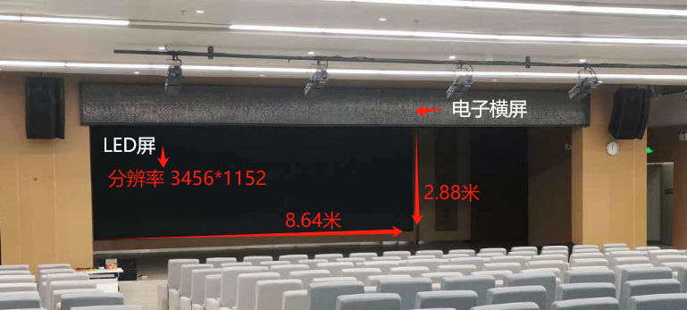

| 设备 | 规格 |
|------|------|
| **LED屏** | 8.64m × 2.88m，分辨率 3456 × 1152 |
| **电子横屏** | 用于显示欢迎信息等内容 |
| **广播音响** | 含调音台、功放 |
| **舞台灯光** | 可调节 |

## 无线信号覆盖

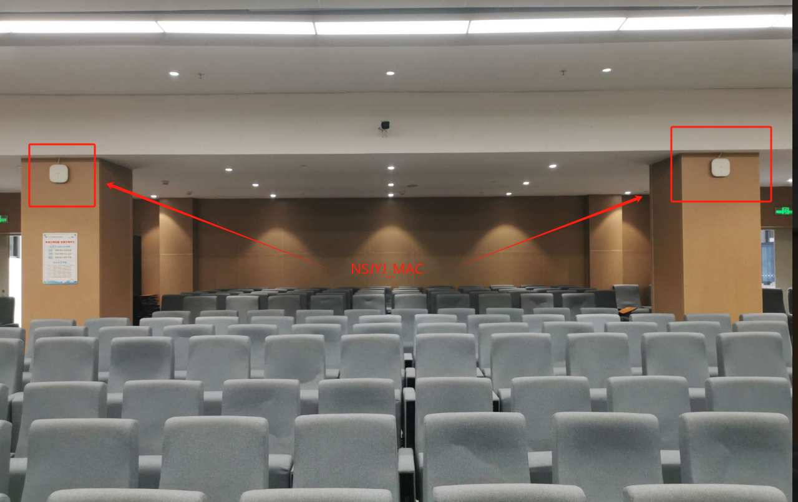
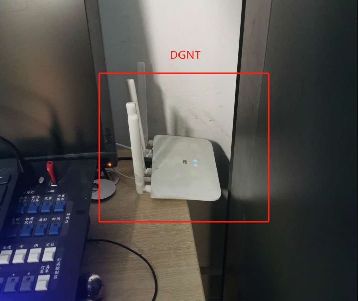

- **南山教育公共WI-FI**（`NSJYJ_MAC`）— 外来人员优先连接
- **DGNT** — 备用信号，最大支持 **30** 个用户

## 公开课场景

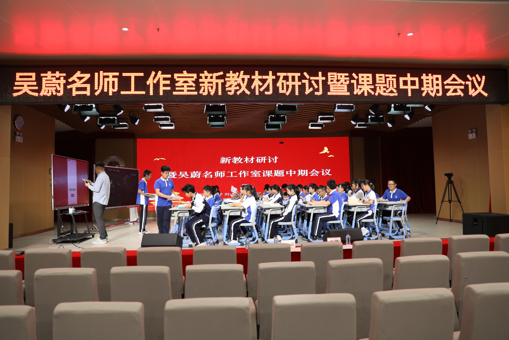

## 照明

### 开关闸位置

位于多功能厅后方电箱内。

## LED 屏

### 开启和关闭

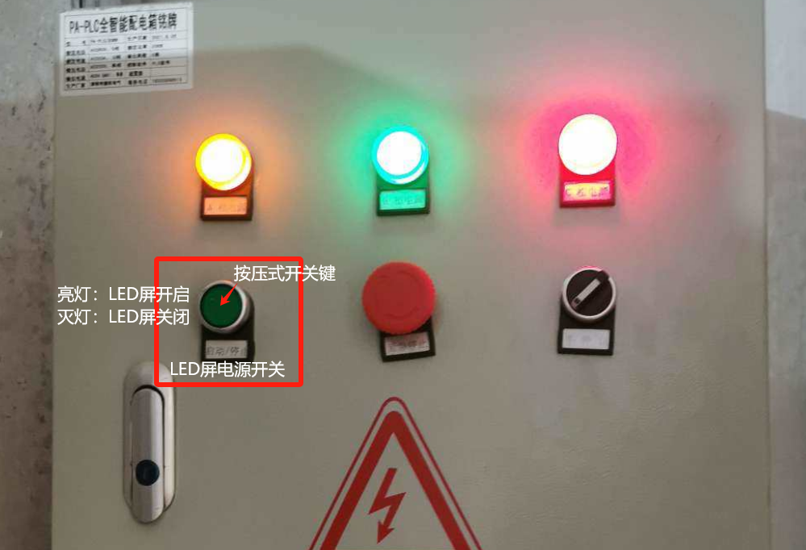

通过控制柜内的空开控制LED屏电源。

### 视频信号源切换

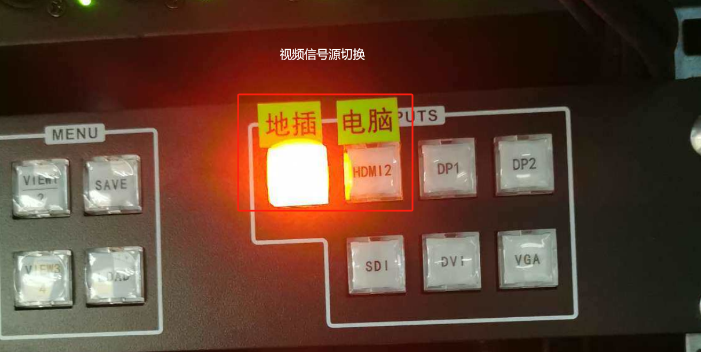

支持以下输入源切换：
- **电脑** — 通过HDMI/VGA连接
- **地插** — 舞台区域的地面接口

## 舞台灯光

### 开关闸

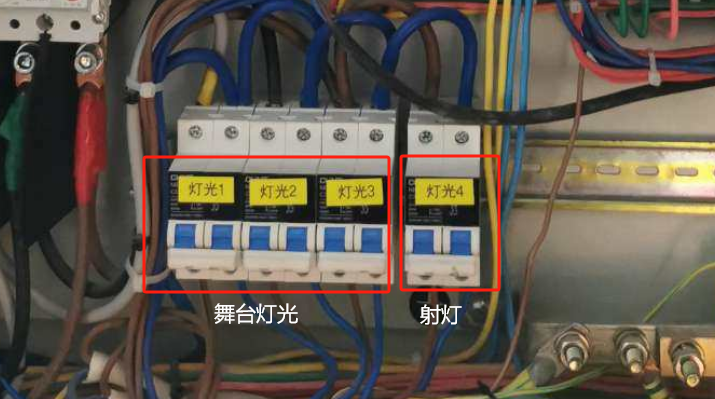

位于舞台侧面的电箱内。

### 灯光调节台

通过灯光调节台控制灯光场景。

## 横屏

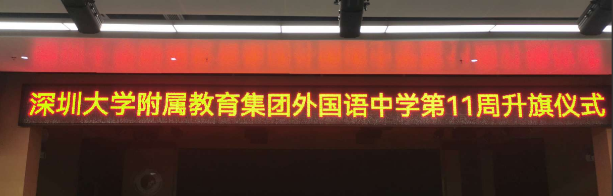

### 电源开关

位于横屏侧面的开关。

### 控制投屏内容

1. 手机扫描二维码下载 **LED 魔宝 APP**
2. 手机连接横屏 WIFI：**ZH-W3 E3E005**（无密码）
3. APP 登录密码：`a12345678`
4. 在 APP 上编辑显示内容

## 调音台

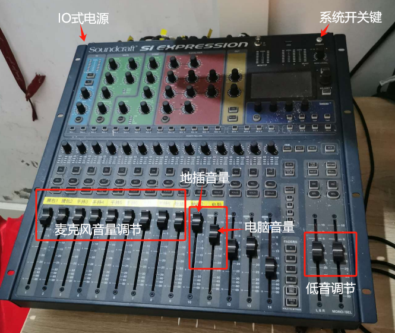

### 功放

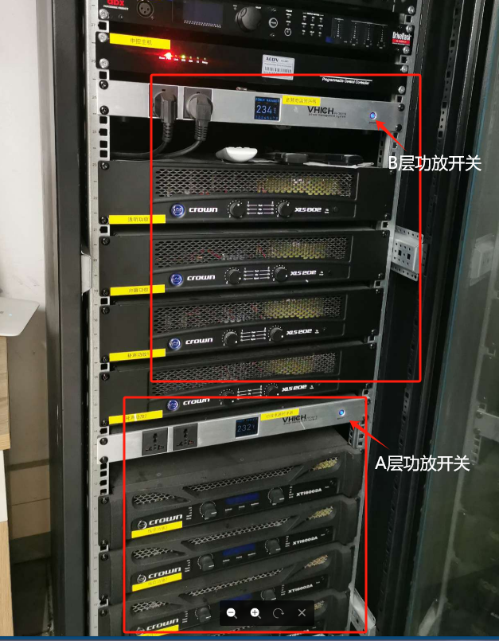

> ⚠️ 按 A 后等待 **30 秒**，待 A 层 4 台功放完全亮灯后再开启 B 层

- 开机顺序：**A 层 → B 层**
- 关机顺序：**B 层 → A 层**

## 直播

用于每周一升旗仪式直播。

### 手机直播

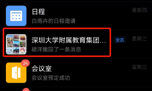

路径：企业微信 → 深大附属外国语中学（全员）→ 直播 → 通用直播

**工具**：手机 + 手机支架

- 连接信号：DGNT
- 手机支在前 2 排中间位置，正对舞台中央
- 设置预约直播，**准点 8:00** 开启
- 直播前 1 分钟通知主持人做好准备

### 电脑直播（待完善）

- 方案 A：录像机 + 采集卡 + OBS 推流
- 方案 B：摄像头 + OBS 推流
- 内网直播服务（待完善）

## 相关页面

- [[hermes-wiki-setup]] — 本Wiki搭建记录

## 内网原始地址

原文及更多图片请访问内网Wiki：
http://192.168.30.97:3000/zh/多功能厅设备管理与使用
